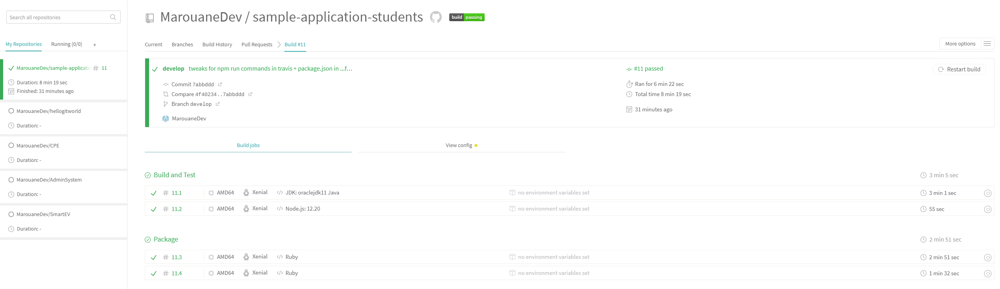
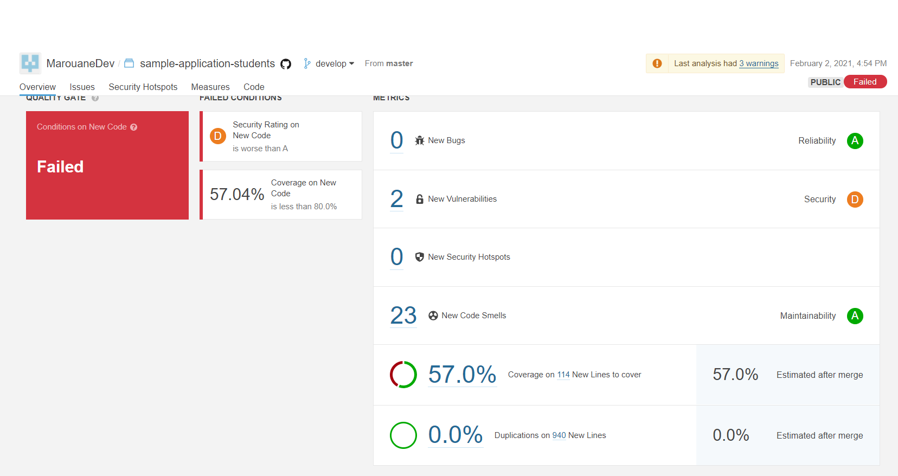

# Marouane AZZOUZ

# TP1 Docker
## Pull docker image
```sh
docker pull <lib> 
```
## Lancer un container

```sh
docker run <container> 
# -it (interactive tty)
# -d detached (background, allowing to type other commands in the current terminal) 
```
## Dockerfile
Dockerfile content :
```Dockerfile
FROM postgres:11.6-alpine # base image
ENV POSTGRES_DB=db \ # env variable
POSTGRES_USER=usr \
POSTGRES_PASSWORD=pwd
```
- To build images.
```sh
docker build . # . is current dir, but this arg is the path to the dockerfile of course
```
- ```-t``` to tag the image

## Run container

```sh
docker run <docker_image>
```
- ```-d``` detached = background
- ```-it``` interactive terminal
- ```-p 80:80``` link machine port 80 to container port 80 
- ```-e ENV=VAR``` add env variable ENV to have value VAR
- ```-v /path/to/dir:/path/to/other/dir``` link a dir to the container e.g. if a container needs to store files in ```/path/to/other/dir```, it'll be stored in the ```/path/to/dir```

## Database

-  Build Dockerfile
```sh
docker build -t marouanedev/sql postgres/ 
```

-  Run the previously mounted image
```sh
docker run --rm --name sql -e POSTGRES_PASSWORD=pwd -v /my/own/datadir:/var/lib/postgresql/data marouanedev/sql
```

- Gotta run adminer to check the database
```sh
docker run --link sql -p 8080:8080 adminer
```
    - creates an adminer container and makes a link with the database container "sql"

## Backend API

- Build dockerfile
```docker build -t marouanedev/java java/simple-api```

- Run the container
```docker run -it --rm --link sql --name java marouanedev/java```
    - Runs the container and links it to the sql container.

- Add ```-p 8080:8080``` to access the api from the browser. 
    - Access Link : http://localhost:8080/departments/IRC/students


## HTTP Server

1. Image build
```docker build -t marouanedev/httpd httpd/```

2.  Run the container linking the api container on port 80
```docker run -dit --rm --link java --name httpd -p 80:80 marouanedev/httpd```

3. Check the server in the browser at localhost.

## Docker compose

- Docker compose allows to build and run the images at once with simple a command :  
```docker-compose up```  
```docker-compose down```


## Publish

- To publish images on docker hub  
    ```docker login```  
    ```docker tag java-api marouanedev/backend:latest```  
    ```docker push marouanedev/backend```

# TP2 CI/CD
## Sample project

```sh
docker compose up # runs docker-compose.yml which seeks for Dockerfiles and executes various commands to run the required containers
```
- Check ```localhost``` ***(beware of cache, ran in private browser)***

## Travis CI
- Language : YAML *(just like many others)*

- Alternatives :
    - Jenkins (less accessible, more customizable)
        - Language : Groovy
    - Gitlab CI
    - Bitbucket Pipeline

### Build and test your applcation

- Build the app thanks to the ```pom.xml``` file

- Test containers : containers run for tests

- 2 stages : 1 for java, the other is for node
    - for java tests : detected Maven thanks to pom.xml
    - node : detected thanks to language (npm is to be used)

- **BEWARE OF YAML INDENTS !!**

## DockerHub, Travis-CI & CD

- We need a develop branch because master is for production

- Add env variables in Travis : name referenced as ```$VAR_NAME``` in .travis.yml **(case sensitive)**

## Config
```yaml
# .travis.yml

git:
  depth: 5
stages:
  - "Build and Test"
  - "Package"
jobs:
  include:
    - stage: "Build and Test"
      language: java
      jdk: oraclejdk11
      before_script:
        - cd sample-application-backend
      script:
        - echo "Maven build"
        - echo "Run test coverage and Quality Gate"
        - mvn clean org.jacoco:jacoco-maven-plugin:prepare-agent install sonar:sonar -Dsonar.projectKey=MarouaneDev_sample-application-students # given by sonarcloud
     # sonarcloud -- (given by sonarcloud)
      addons:
        sonarcloud:
          organization: "marouanedev"
          token: "$SONARCLOUD_TOKEN" # command just as in the devops doc
     # -- sonarcloud
    - stage: "Build and Test"
      language: node.js
      node_js: "12.20"
      before_script:
        - cd sample-application-frontend
      script:
        - echo "NPM install and build"
        - npm install
        - npm run lint
        - npm run test
    - stage: "Package"
      if: branch = develop # only on develop
      before_script:
        - cd sample-application-backend
      script:
        - echo "Docker build ..."
        - docker build -t $DOCKER_ID/backend . # added - docker
        - echo "Docker login ..."
        - echo "$DOCKER_PASSWORD" | docker login -u "$DOCKER_ID" --password-stdin # added - docker
        - echo "Docker push ..."
        - docker push $DOCKER_ID/backend # added - docker
    - stage: "Package"
      if: branch = develop # only on develop
      before_script:
        - cd sample-application-frontend
      script:
        - echo "Docker build ..."
        - docker build -t $DOCKER_ID/frontend . # added - docker
        - echo "Docker login ..."
        - echo "$DOCKER_PASSWORD" | docker login -u "$DOCKER_ID" --password-stdin # added - docker
        - echo "Docker push ..."
        - docker push $DOCKER_ID/frontend # added - docker
cache:
  directories:
    - "$HOME/.m2/repository"
    - "$HOME/.npm"

services:
  - docker
```
### Overview


## Setup Quality Gate

- Create SONARCLOUD_TOKEN in Travis-CI website.
- The ```.yml``` config from the last point is the one I used for Sonarcloud.

### Overview



# TP3 Ansible

## Intro

### Setup

- ```/api/actuator``` returns all routes of the application (springboot)

### Inventories

- **Beware of indents again with yml files**
- ```ansible all -i ansible/inventories /setup.yml -m ping```

### Facts
```sh
ansible all -i ansible/inventories /setup.yml -m setup -a "filter=ansible_distribution*" 
``` 

## Playbooks

### First playbook

- $basearch. You can use $basearch to reference the base architecture of the system. For example, i686 machines have a base architecture of i386 , and AMD64 and Intel 64 machines have a base architecture of x86_64

### Using Roles

- move the ```tasks``` related to Docker and move them to the ```roles/docker/tasks/main.yml``` and then add :
```yaml
# playbook.yml
    roles:
        - docker # role to start (tasks)
        # add the other roles
```
- Les modifs de fichier à faire sont dans ```role/docker/tasks/main.yml```

## Deploy your App

- Create the roles and edit the ```main.yml``` files in ```ansible/roles/<role_name>/tasks/main.yml```.
    - These files basically do what the ```docker-compose.yml``` did.
- Do not forget to install python in ansible otherwise it **fails**
- Example of config :
    ```yaml
    - name: Launching frontend # name of the task (displayed in terminal)
    docker_container: # container creation
        name: frontend # container name
        image: marouanedev/frontend # docker image
        ports: # ports <machine:container>
        - "80:80"
        networks: 
        - name: app-network # linking the container to a network
    ```
- Other options :
    ```yaml
    - name: Name
    # ...
    docker_container:
        # ...
        env:
            SPRING_DATASOURCE_URL: jdbc:postgresql://database:5432/SchoolOrganisation # name of the env variable + value
    ```
- Launching all this : ```ansible-playbook -i inventories/setup.yml playbook.yml```
